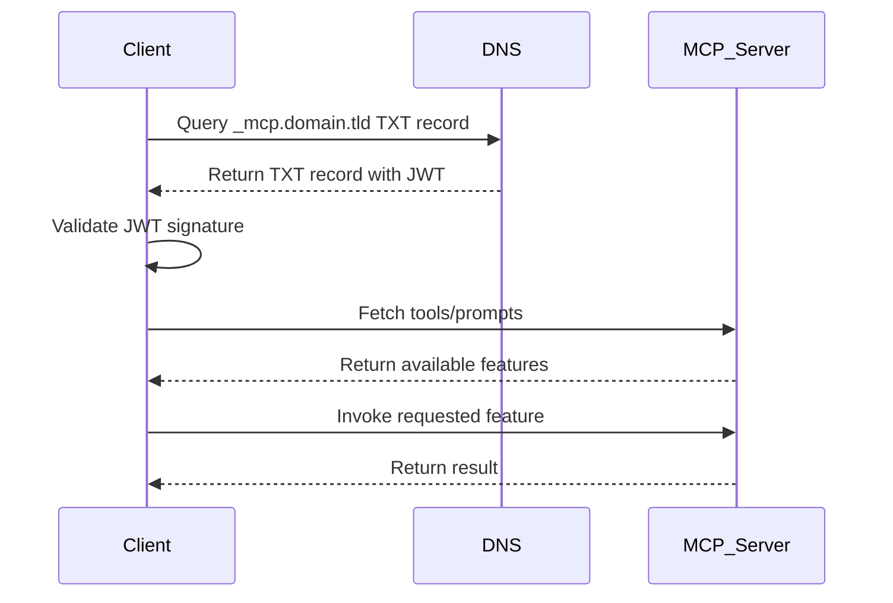

<div id="enable-section-numbers" />

<Info>**Protocol Revision**: draft</Info>

## Introduction

The key words “MUST”, “SHOULD”, and “MAY” are to be interpreted as described in RFC 2119.

### Purpose and Scope

Currently, an MCP client requires all MCP servers to be registered manually.
This leads to significant configuration overhead,
especially when a client wants to combine multiple MCP servers dynamically or
discover tools/prompts across heterogeneous environments.

This document introduces a mechanism for **Auto-Discovery**,
allowing clients to automatically discover MCP servers and their
tools/prompts based on a given domain.

This concept does not change the major behavior of the Model Context Protocol,
which is described in the llms.txt - Revision 2024-06-18.
The auto discovery starts and ends bevor the MCP workflows are starting.

---

## Motivation

An automatic discovery mechanism would greatly improve interoperability and
usability by enabling MCP clients to:

- Dynamically find and register MCP servers.
- Validate the legitimacy of discovered servers.
- Automatically resolve and combine tools and prompts from multiple servers.

---

## Goals

- **Dynamic Discovery**: Enable clients to discover MCP servers based on a domain name.
- **Secure Validation**: Ensure the discovered server is authentic and not tampered with.
- **Ease of Use**: Provide developers with a simple integration mechanism.

---

## Design Overview

To make auto-discovery possible, two things are needed:

1. A URI Schema where the MCP client can use to detect MCP servers and MCP features to use.
2. A secure mechanism to retrieve the real endpoint of MCP servers without the need of a global registry.

 The Auto-Discovery procedure is performed **before** any regular MCP request/response cycle.
 Once a server URL has been resolved, the client **MUST** continue to use the standard HTTP endpoints defined in the current MCP reference (e.g. `/v1/models`, `/v1/tools`).
 The proposal therefore introduces no breaking change and is fully backward-compatible.


### Auto-Discovery URI Scheme

A new URI scheme `mcp://` is introduced:

```
mcp://<domain>/<server_name>/<mcp_feature>/<mcp_feature_name>
```

- `<domain>`: The domain to query for MCP server discovery.
- `<server_name>`: The logical name of the MCP server within the domain.
- `<mcp_feature>`: The feature to use, e.g. prompts/tools/resources.
- `<mcp_feature_name>`: The specific name of the MCP feature to use.

All path components  (`<server_name>`,`<mcp_feature>`,`<mcp_feature_name>` )
are case-insensitive ASCII strings matching the regular expression `[a-z0-9\-]+`.
Any non-matching character **MUST** be percent-encoded.

This URI scheme has been designed to provide a clear and secure way for MCP clients to resolve and use MCP features.
The `<domain>` component allows the client to locate an authoritative TXT DNS record that contains a signed JWT for discovery.
By requiring a TXT record, we ensure that any MCP server resolved from this process is explicitly authorized by the domain owner,
preventing unauthorized servers from being injected.

The `<server_name>` identifies the actual MCP server endpoint within that domain,
allowing for multiple MCP servers to be defined under the same domain for different contexts or purposes.
This flexibility supports the use of domain-specific MCP servers tailored to different business domains or technical requirements.

---

### JWT Format

The JWT to discover the MCP server endpoint SHOULD have these claims:

 - `iss` (required): Domain name that owns the record
 - `exp` (required): Unix-timestamp, MUST NOT be in the past
 - `mcpServers` (required): Map <server_name, https_url>
 - `metaInformation` (optional):  Map <key, value>

 The JWT **MUST** be signed with `alg` =`ES256` or `RS256`.
 The public key can be obtained either
 - from a JWK Set at `https://<domain>/.well-known/mcp-jwks.json`, or
 - embedded as `jku` / `jwk` header parameters, or
 - singed from an official CA.


### Discovery Workflow

1. **TXT Record Lookup**
   - The client queries the domain `domain.tld` for a special TXT record:
     ```
     _mcp.domain.tld. IN TXT "eyJhbGciOiJFUzI1NiIsInR5cCI6IkpXVCJ9..."
     ```
   - The TXT record contains a **JWT** with a signed list of authorized MCP servers.
   - HTTPS Fallback (Optional)
      If no valid `_mcp.<domain>` TXT record is found, a client **MAY** issue
      `GET https://<domain>/.well-known/mcp.json`.
      The JSON document MUST contain a `jwt` field with the same payload semantics as the DNS-based JWT.


2. **JWT Validation**
   - The client verifies the JWT signature using a trusted public key, which is signed by an official CA.
   - The JWT payload includes:
     - A list of MCP servers
     - An expiration timestamp (`exp`)
     - Optional metadata like namespaces.

3. **Server Query**
   - After successful validation, the client fetches the available tools/prompts from the discovered MCP servers.

4. **Tool Execution**
   - The client invokes the specified feature from the resolved MCP server.




---

## Security Considerations

- **DNS Integrity** – Clients **SHOULD** verify DNSSEC signatures when available.
 If DNSSEC is not deployed, clients **SHOULD** perform the TXT lookup via DoH/DoT.
- **Signature Verification**: All JWT MUST be signed using a trusted key hierarchy.
 The JWT MUST be validated before use.
- **Allowlist Support**: Clients MAY support domain or issuer allowlists for additional safety.

---


## Example

**URI Example**
```
mcp://example.com/mcpServerForContext1/tools/search
```

**TXT Record**
```
_mcp.example.com. IN TXT "eyJhbGciOiJFUzI1NiIsInR5cCI6IkpXVCJ9..."
```

**JWT Payload**
```json
{
  "iss": "example.com",
  "sub": "mcp-autodiscovery",
  "exp": 1757923199,
  "mcpServers": {
    "mcpServerForContext1": "https://mcp1.example.com",
    "mcpServerForContext2": "https://mcp2.example.com"
  }
}
```


---

## To Be Determined

- Should DNSSEC be mandatory or optional for this specification?
 - **Proposal**: "SHOULD"

- Should clients be allowed to combine multiple servers signed by the same domain?
 - **Proposal**: "SHOULD"

- Should a fallback without JWT (e.g., simple TXT record with URL) be permitted?
 - **Proposal**: Only in private networks described in RFC 1918
---

## Advantages

- Reduces configuration overhead in multi-server environments.
- Promotes standardization for public MCP servers.
- Provides cryptographic security for server validation.
- No need to maintain a registry service.
- Easy to scale up.

---

## Next Steps

1. Initiate discussion in the MCP repository.
2. Provide a proof-of-concept implementation of the Auto-Discovery client.
3. Gather feedback on the security model and trust hierarchy.

```
