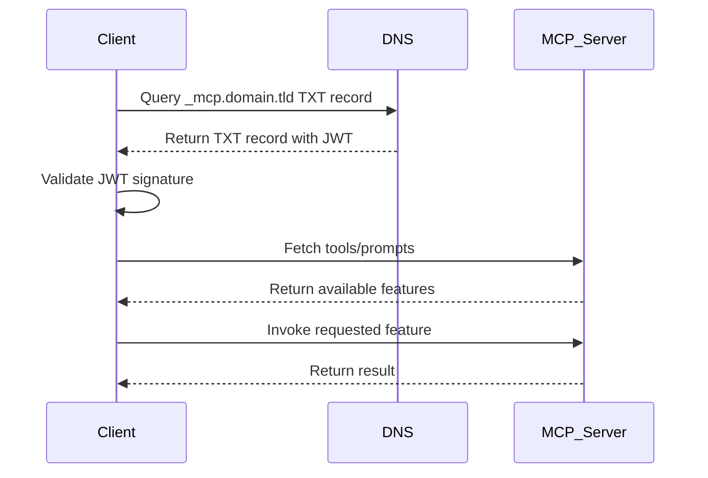

<div id="enable-section-numbers" />

<Info>**Protocol Revision**: draft</Info>

## Introduction

### Purpose and Scope

Currently, an MCP client requires all MCP servers to be registered manually.
This leads to significant configuration overhead,
especially when a client wants to combine multiple MCP servers dynamically or
discover tools/prompts across heterogeneous environments.

This document introduces a mechanism for **Auto-Discovery**,
allowing clients to automatically discover MCP servers and their
tools/prompts based on a given domain.

---

## Motivation

An automatic discovery mechanism would greatly improve interoperability and
usability by enabling MCP clients to:

- Dynamically find and register MCP servers.
- Validate the legitimacy of discovered servers.
- Automatically resolve and combine tools and prompts from multiple servers.

---

## Goals

- **Dynamic Discovery**: Enable clients to discover MCP servers based on a domain name.
- **Secure Validation**: Ensure the discovered server is authentic and not tampered with.
- **Ease of Use**: Provide developers with a simple integration mechanism.

---

## Design Overview

To make auto-discovery possible, two things are needed:

1. A URI Schema where a mcp client can use to detect mcp servers and mcp features to use.
2. A secure mechanism to retrieve the real endpoint of a mcp servers without the need of a global registry.

### Auto-Discovery URI Scheme


A new URI schema `mcp://` is introduced:

```
mcp://<domain>/<server_name>/<mcp_feature>/<mcp_feature_name>
```

- `<domain>`: The domain to query for MCP server discovery.
- `<server_name>`: The logical name of the MCP server within the domain.
- `<mcp_feature>`: The feature to use, e.g. prompts/tools/resources.
- `<mcp_feature_name>`: The specific name of the mcp feature to use.

This URI scheme has been designed to provide a clear and secure way for MCP clients to resolve and use MCP features.
The `<domain>` component allows the client to locate an authoritative TXT DNS record that contains a signed JWT for discovery.
By requiring a TXT record, we ensure that any MCP server resolved from this process is explicitly authorized by the domain owner,
preventing unauthorized servers from being injected.

The `<server_name>` identifies the actual MCP server endpoint within that domain,
allowing for multiple MCP servers to be defined under the same domain for different contexts or purposes.
This flexibility supports the use of domain-specific MCP servers tailored to different business domains or technical requirements.

---

### Discovery Workflow

1. **TXT Record Lookup**
   - The client queries the domain `domain.tld` for a special TXT record:
     ```
     _mcp.domain.tld. IN TXT "eyJhbGciOiJFUzI1NiIsInR5cCI6IkpXVCJ9..."
     ```
   - The TXT record contains a **JWT** with a signed list of authorized MCP servers.

2. **JWT Validation**
   - The client verifies the JWT signature using a trusted public key, which is signed by an official CA.
   - The JWT payload includes:
     - A list of MCP servers
     - An expiration timestamp (`exp`)
     - Optional metadata like namespaces.

3. **Server Query**
   - After successful validation, the client fetches the available tools/prompts from the discovered MCP servers.

4. **Tool Execution**
   - The client invokes the specified feature from the resolved MCP server.



---

## Security Considerations

- **Signature Verification**: All TXT records must be signed using a trusted key hierarchy.
- **DNSSEC/DoH Recommendation**: To prevent DNS spoofing attacks, clients are encouraged to use DNSSEC or DNS-over-HTTPS.
- **Allowlist Support**: Clients MAY support domain or issuer allowlists for additional safety.

---


## Example

**URI Example**
```
mcp://example.com/mcpServerForContext1/tools/search
```

**TXT Record**
```
_mcp.example.com. IN TXT "eyJhbGciOiJFUzI1NiIsInR5cCI6IkpXVCJ9..."
```

**JWT Payload**
```json
{
  "iss": "example.com",
  "sub": "mcp-autodiscovery",
  "exp": 1757923199,
  "mcpServers": {
    "mcpServerForContext1": "https://mcp1.example.com",
    "mcpServerForContext2": "https://mcp2.example.com"
  }
}
```


---

## Open Questions

- Should DNSSEC be mandatory or optional for this specification?
- Should clients be allowed to combine multiple servers signed by the same domain?
- Should a fallback without JWT (e.g., simple TXT record with URL) be permitted, e.g. for usage in private networks?

---

## Advantages

- Reduces configuration overhead in multi-server environments.
- Promotes standardization for public MCP servers.
- Provides cryptographic security for server validation.
- No need to maintain a registry service.
- Easy to scale up.

---

## Next Steps

1. Initiate discussion in the MCP repository.
2. Provide a proof-of-concept implementation of the Auto-Discovery client.
3. Gather feedback on the security model and trust hierarchy.

```
